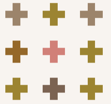

### 这是什么？
该项目基于[Bluemarble](https://github.com/SwingTheVine/Wplace-BlueMarble)，在源项目基础上做了一些视觉优化。

### 优化了什么？

将源项目中的3*3像素的方形小方块，改为了十字型，如下图所示

### 如何安装？

将**dist**文件夹下的**BlueMarble.user.js**文件拖入到**Tampermonkey**的控制面板安装，我已经打包了，可直接安装。

也可以将该项目下载后，安装依赖，运行`npm run build`，自行打包并安装，打包后文件位置同上。
